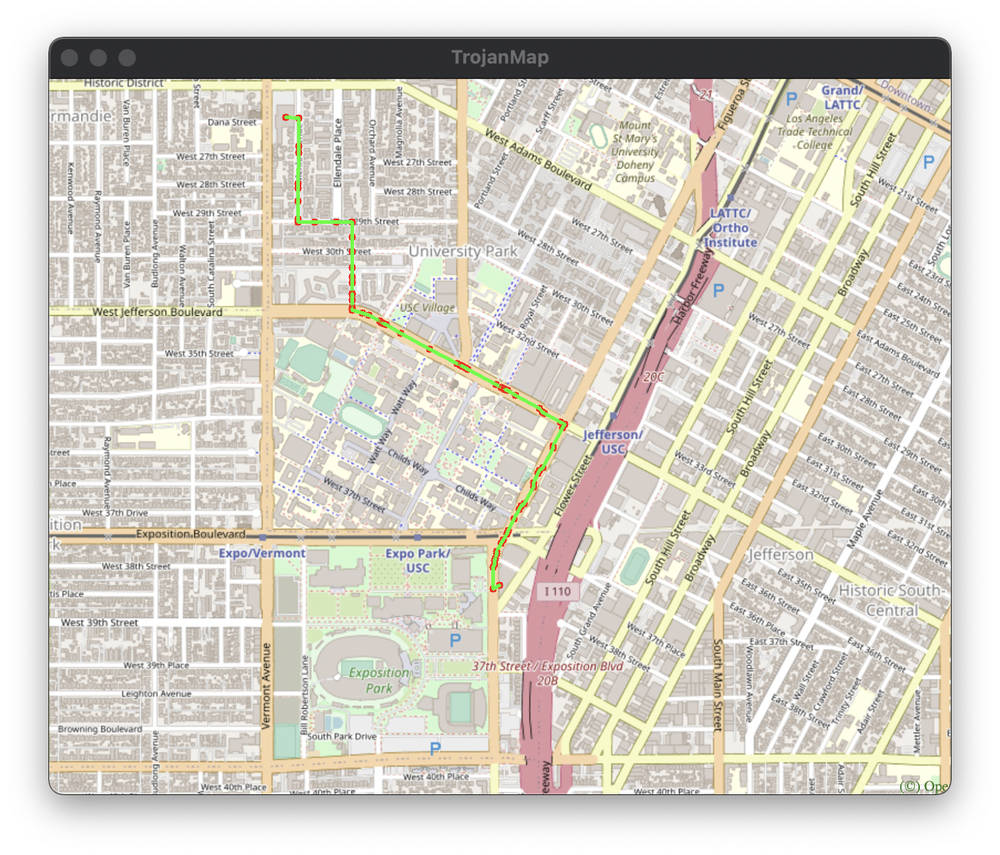
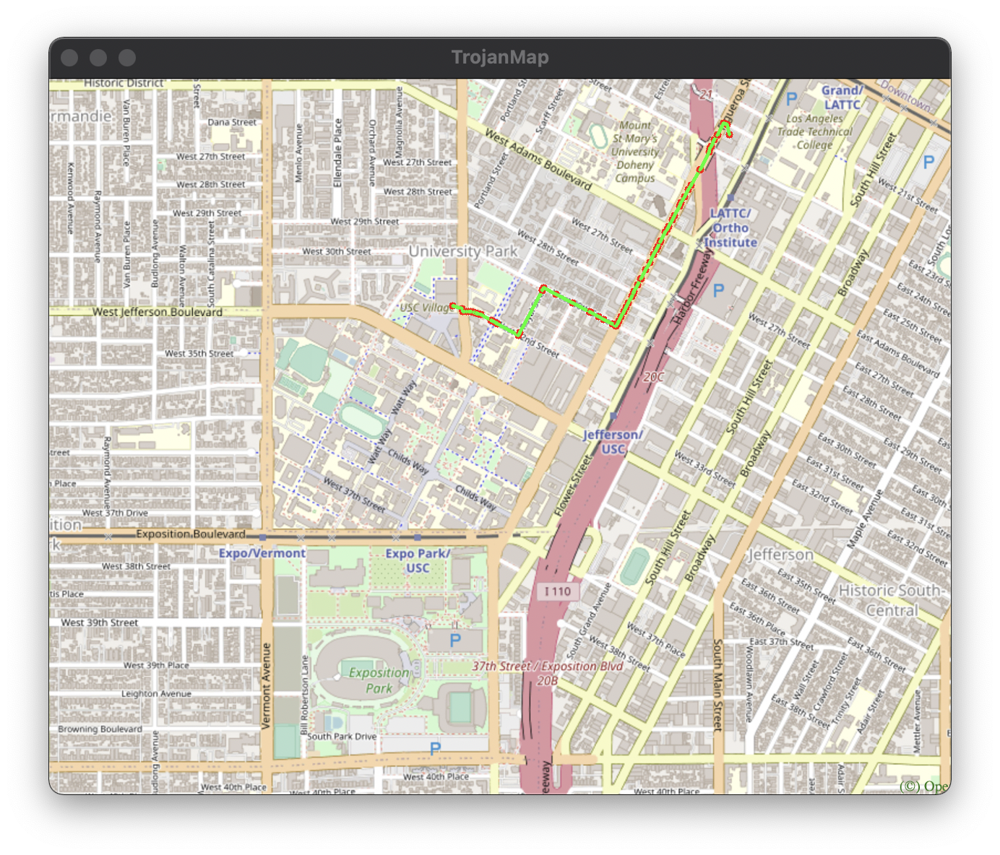
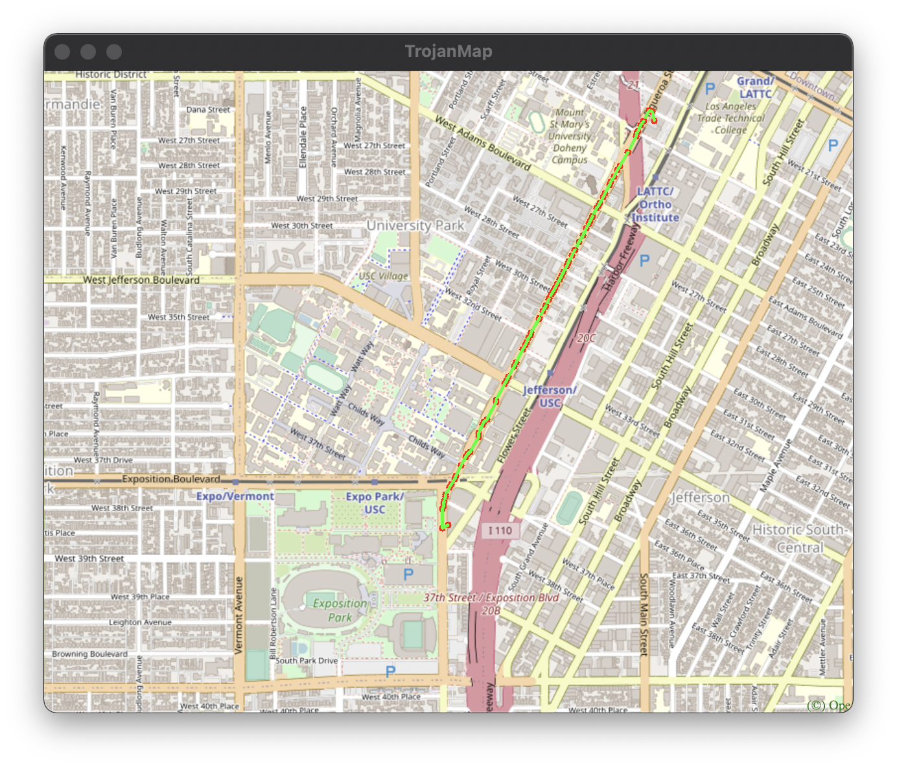
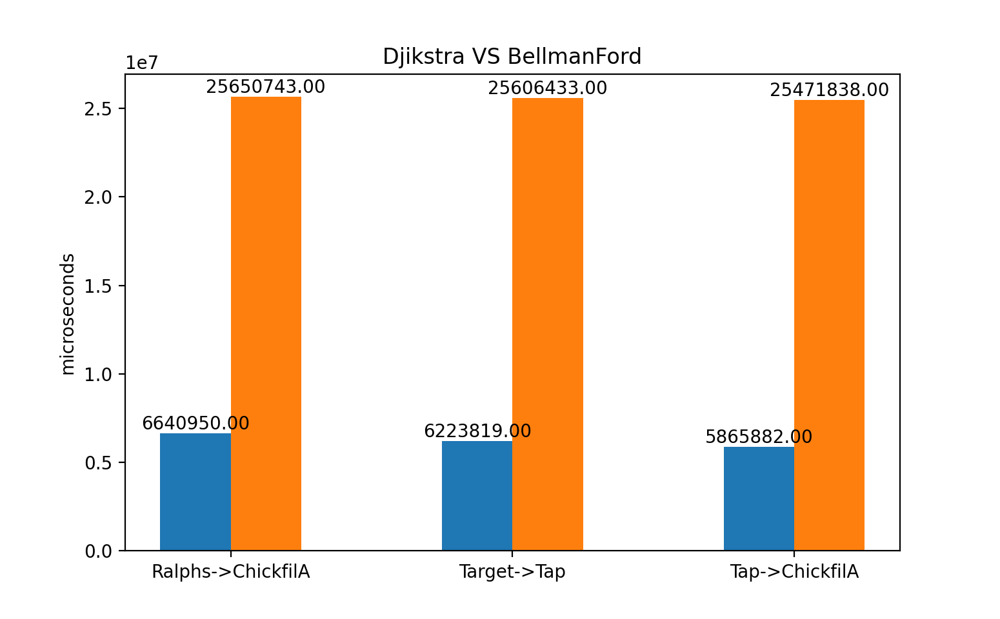
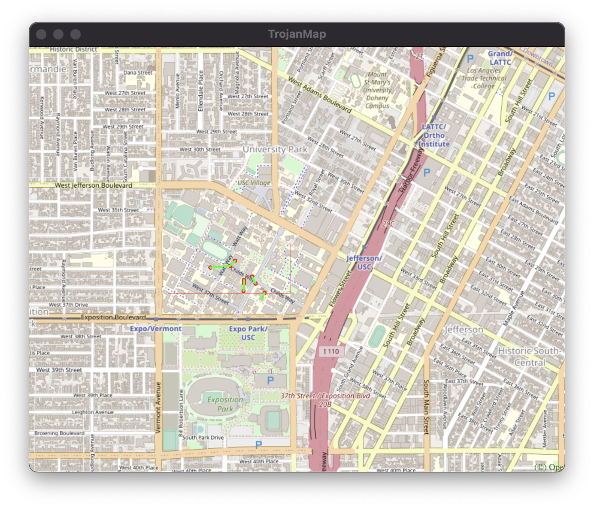
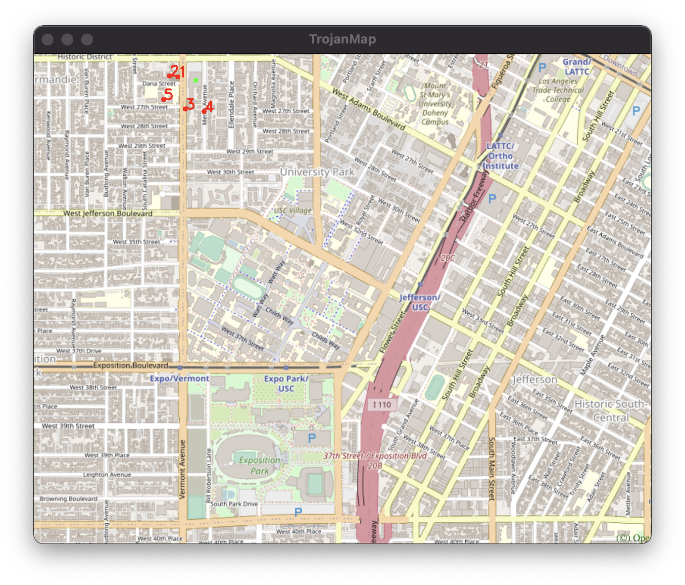

# Di An's Final Report

## Team Member : Di An ( USC ID : 8566513464 )


## Content

1.  Autocomplete the location name
2.  Find the place's Coordinates in the Map
3.  CalculateShortestPath between two places
4.  The Traveling Trojan Problem
5.  Cycle Detection
6.  Topological Sort
7.  Find K closest points

## TrojanMap

This project focuses on using data structures in C++ and implementing various graph algorithms to build a map application.

<p align="center"></p>

- Please clone the repository, look through [README.md](README.md) and fill up functions to finish in the project.
- Please make sure that your code can run `bazel run/test`.
- In this project, you will need to fill up [trojanmap.cc](src/lib/trojanmap.cc) and add unit tests in the `tests` directory.

---

## The data Structure

Each point on the map is represented by the class **Node** shown below and defined in [trojanmap.h](src/lib/trojanmap.h).

```cpp
class Node {
  public:
    std::string id;    // A unique id assign to each point
    double lat;        // Latitude
    double lon;        // Longitude
    std::string name;  // Name of the location. E.g. "Bank of America".
    std::vector<std::string>
        neighbors;  // List of the ids of all neighbor points.
};

```


```shell
Torjan Map
**************************************************************
* Select the function you want to execute.                    
* 1. Autocomplete                                             
* 2. Find the position                                        
* 3. CalculateShortestPath                                    
* 4. Travelling salesman problem                              
* 5. Cycle Detection                                          
* 6. Topological Sort                                         
* 7. Find K Closest Points                                    
* 8. Exit                                                     
**************************************************************
Please select 1 - 8:
```


## Step 1: Autocomplete the location name

### 1.1 Function
```c++
std::vector<std::string> TrojanMap::Autocomplete(std::string name);
```

In this function, we need to autocomplete the words the user searching for. 
It's just a easy comparision while traverse all the nodes inside the graph. Here what's the main idea of this function is below:

```shell
std::string temp = it->second.name.substr(0, name.length());
```

### 1.2 Result
In this function, we need to make sure that if the input is invalid, the output should also be invalid.

```shell
1
**************************************************************
* 1. Autocomplete                                             
**************************************************************

Please input a partial location:ch
*************************Results******************************
ChickfilA
Chipotle Mexican Grill
**************************************************************
Time taken by function: 1904 microseconds
```

```shell
**************************************************************
* 1. Autocomplete                                             
**************************************************************

Please input a partial location:66
*************************Results******************************

**************************************************************
Time taken by function: 1748 microseconds
```
We can see from the result, each result comes with almost the same time, because the algorithem is traveling all the points, and check the validation of the name. So the runtime Compelexity is O(n).

## Step 2: Find the place's Coordinates in the Map

```c++
std::pair<double, double> GetPosition(std::string name);
```
### 2.1 Function

In this function, the main idea is same as before, we travell all the nodes, and compare the name with the input.

### 2.2 Results

```shell
2
**************************************************************
* 2. Find the position                                        
**************************************************************

Please input a location:Target
*************************Results******************************
Latitude: 34.0257 Longitude: -118.284
**************************************************************
Time taken by function: 1215 microseconds
```

<p align="center"></p>


```shell
2
**************************************************************
* 2. Find the position                                        
**************************************************************

Please input a location:66
-1-1
*************************Results******************************
No matched locations.
**************************************************************
Time taken by function: 838 microseconds
```

From the result we can also see that the time complexity is O(n).


## Step 3: CalculateShortestPath between two places
## 3.1 Dijkstra.
```c++
std::vector<std::string> CalculateShortestPath_Dijkstra(std::string &location1_name, std::string &location2_name);
```
First we use dijkstra to caculate the shortest distance. Besides using the distance matrix, we also need a pr matrx to store the father of the node with current min_distancer. So in this way we can keep tracking the path to the current node or the final node. In dijkstra, strating with the start location, we keep updating the 2 matrix untill we reach to the destination.
```c++
std::unordered_map<std::string, std::string> pr; // id : father
```

## 3.2 Bellman_Ford
```c++
std::vector<std::string> CalculateShortestPath_Bellman_Ford(std::string &location1_name, std::string &location2_name);
```
In Bellman_Ford function, the main idea is to relax all the edges during each iteration, and same like the dijkstra, we need to put the pr matrix to keep tracking the path
```c++
for(int i = 0; i < data.size() -1; i++){
    // repeat data.size() - 1 times
    // for each node we need to check and relax it
    //since d[start_id] = 0 is the min value it can reach, so dont need to worry about itea contains the start_id
    for(auto it_v = data.begin(); it_v != data.end(); it_v++)
```

## 3.3 Results

1. Ralphs -> ChickfilA

```cpp
Please input the start location:Ralphs
Please input the destination:ChickfilA
```


Djikstra:
```cpp
The distance of the path is:1.53852 miles
**************************************************************
Time taken by function: 6640950 microseconds
```
<p align="center"></p>

Bellman_Ford:
```cpp
The distance of the path is:1.53852 miles
**************************************************************
Time taken by function: 25650743 microseconds
```
<p align="center"></p>

2. Target -> Tap Two Blue
Please input the start location:Target
Please input the destination:Tap Two Blue


Djistra:
```cpp
The distance of the path is:1.00965 miles
**************************************************************
Time taken by function: 6223819 microseconds
```
<p align="center"></p>


Bellman_ford:
```cpp
The distance of the path is:1.00965 miles
**************************************************************
Time taken by function: 25606433 microseconds
```
<p align="center"></p>

3. Tap Two Blue -> ChickfilA
```cpp
Please input the start location:Tap Two Blue
Please input the destination:ChickfilA
```

Djikstra:
```cpp
The distance of the path is:1.21292 miles
**************************************************************
Time taken by function: 5865882 microseconds
```
<p align="center"></p>

Bellman_Ford:
```cpp
The distance of the path is:1.21292 miles
**************************************************************
Time taken by function: 25471838 microseconds
```
<p align="center"></p>

In the results, i didn't put all the result of actual path because it will take a lot of place to do that. Instead, if the two algorithms have the same outcome, then I regard it's the min path. Here I make the chart betweem alorithms
<p align="center"></p>

From the hist we can see that djikstra runs faster than bellman_ford. It is because dijkstra doesn't run all of the nodes in the graph. Instead, it jumps out if it reaches to the destination. So the worst run time of Djikstra is O(n + m), where n is the # of nodes, m is the # of edges. However, the run time complexity for bellman_ford is always O(n^2) since it needs to traval all the nodes and relax the edges.


## Step 4: The Traveling Trojan Problem (AKA Traveling Salesman!)

In this section, we assume that a complete graph is given to you. That means each node is a neighbor of all other nodes.
Given a vector of location ids, assume every location can reach all other locations in the vector (i.e. assume that the vector of location ids is a complete graph).
Find the shortest route that covers all the locations exactly once and goes back to the start point. 

You will need to return the progress to get the shortest route which will then be converted to an animation.  

We will use the following algorithms:

- Backtracking
```c++
std::pair<double, std::vector<std::vector<std::string>>> TravellingTrojan(
      std::vector<std::string> &location_ids);
```
- [2-opt Heuristic](https://en.wikipedia.org/wiki/2-opt). Also see [this paper](http://cs.indstate.edu/~zeeshan/aman.pdf)
```c++
std::pair<double, std::vector<std::vector<std::string>>> TravellingTrojan_2opt(
      std::vector<std::string> &location_ids);
```

Please report and compare the time spent by these 2 algorithms. 2-opt algorithm may not get the optimal solution. Please show how far your solution is from the optimal solution.

Show the routes on the map. For each intermediate solution, create a new plot. Your final video presentation should include the changes to your solution.

We will randomly select N points in the map and run your program.

```shell
4
**************************************************************
* 4. Travelling salesman problem                              
**************************************************************

In this task, we will select N random points on the map and you need to find the path to travel these points and back to the start point.

Please input the number of the places:10
Calculating ...
*************************Results******************************
The distance of the path is:4.70299 miles
**************************************************************
You could find your animation at src/lib/output.avi.          
Time taken by function: 152517394 microseconds
```

<p align="center"></p>

<p align="center"></p>

## Step 5: Cycle Detection

```c++
bool CycleDetection(std::vector<double> &square);
```

In this section, we use a square-shaped subgraph of the original graph by using four coordinates stored in ```std::vector<double> square```, which follows the order of left, right, upper, and lower bounds. 

Then try to determine if there is a cycle path in the that subgraph. If it does, return true and report that path on the map. Otherwise return false.

Example 1:
```shell
Input: square = {-118.299, -118.264, 34.032, 34.011}
Output: true
```
Here we use the whole original graph as our subgraph. 
<p align="center"></p>

Example 2:
```shell
Input: square = {-118.290919, -118.282911, 34.02235, 34.019675}
Output: false
```
Here we use a square area inside USC campus as our subgraph
<p align="center"></p>

Note: You could use the function below to visualize the subgraph. 

```c++
/**
 * PlotPoints: Given a vector of location ids draws the points on the map (no path).
 * 
 * @param  {std::vector<std::string>} location_ids : points inside square
 * @param  {std::vector<double>} square : boundary
 */
void TrojanMap::PlotPointsandEdges(std::vector<std::string> &location_ids, std::vector<double> &square)
```
```shell
5
**************************************************************
* 5. Cycle Detection                                          
**************************************************************

Please input the left bound longitude(between -118.299 and -118.264):-118.299
Please input the right bound longitude(between -118.299 and -118.264):-118.264
Please input the upper bound latitude(between 34.011 and 34.032):34.032
Please input the lower bound latitude(between 34.011 and 34.032):34.011
*************************Results******************************
there exists cycle in the subgraph 
**************************************************************
Time taken by function: 273734 microseconds

5
**************************************************************
* 5. Cycle Detection                                          
**************************************************************

Please input the left bound longitude(between -118.299 and -118.264):-118.290919
Please input the right bound longitude(between -118.299 and -118.264):-118.282911
Please input the upper bound latitude(between 34.011 and 34.032):34.02235
Please input the lower bound latitude(between 34.011 and 34.032):34.019675
*************************Results******************************
there exist no cycle in the subgraph 
**************************************************************
Time taken by function: 290371 microseconds
```
## Step 6: Topological Sort

```c++
std::vector<std::string> DeliveringTrojan(std::vector<std::string> &location_names,
                                            std::vector<std::vector<std::string>> &dependencies);
```

Tommy Trojan got a part-time job from TrojanEats, for which he needs to pick up and deliver food from local restaurants to various location near the campus. Tommy needs to visit a few different location near the campus with certain order, since there are some constraints. For example, he must first get the food from the restaurant before arriving at the delivery point. 

The TrojanEats app will have some instructions about these constraints. So, Tommy asks you to help him figure out the feasible route!

Here we will give you a vector of location names that Tommy needs to visit, and also some dependencies between those locations.


For example, 

```shell
Input: 
location_names = {"Cardinal Gardens", "Coffee Bean1", "CVS"}
dependencies = {{"Cardinal Gardens","Coffee Bean1"}, {"Cardinal Gardens","CVS"}, {"Coffee Bean1","CVS"}}
```

Here, ```{"Cardinal Gardens","Coffee Bean1"}``` means
that Tommy must go to `Cardinal Gardens` prior to `Coffee Bean1`.

Your output should be:
```shell
Output: Cardinal Gardens -> Coffee Bean1 -> CVS
```
Also, we provide ```PlotPointsOrder``` function that can visualize the results on the map. It will plot each location name and also some arrowed lines to demonstrate a feasible route.

If no feasible route exists, you could simply return an empty vector.

Hint:
- You also need to finish ```ReadLocationsFromCSVFile``` and ```ReadDependenciesFromCSVFile``` functions, so you could read and parse data from you own CSV files. We also give two sample CSV files under ```input``` folder, which could be a reference. 
- When it asks you filenames, you need to give the absolute path.
- If you do not have ```ReadLocationsFromCSVFile``` and ```ReadDependenciesFromCSVFile``` functions ready yet, you can just press enter when it asks you filenames. It will call the default locations and dependencies.
- The locations are actually nodes, and the dependencies could be directed edges. You may want to first construct a DAG and then implement topological sort algorithm to get the route.

```shell
6
*************************Results******************************
Topological Sorting Results:
Cardinal Gardens
Coffee Bean1
CVS
**************************************************************
Time taken by function: 43 microseconds
```
<p align="center"></p>

In the user interface, we read the locations and dependencies from `topologicalsort_dependencies.csv` and `topologicalsort_locations.csv` to modify your input there.

## Step 7: Find K closest points

Given a location name and a integer k , find the k closest locations with name on the map and return a vector of string ids. 

We will use the following algorithms:

- Backtracking
```c++
std::vector<std::string> FindKClosestPoints(std::string name, int k);
```

Please report and compare the time spent by this algorithm and show the points on the map.

```shell
**************************************************************
* 7. Find K Closest Points                                    
**************************************************************

7
**************************************************************
* 7. Find K Closest Points                                    
**************************************************************

Please input the locations:Ralphs
Please input k:5
*************************Results******************************
Find K Closest Points Results:
1 St Agnes Church
2 Saint Agnes Elementary School
3 Warning Skate Shop
4 Menlo AvenueWest Twentyninth Street Historic District
5 Vermont Elementary School
**************************************************************
Time taken by function: 1975 microseconds
```

<p align="center"></p>


## Reporting Runtime:
For each menu item, your program should show the time it took to finish each task.

Please make sure to provide various examples when you report the runtime. For example for topological sort, show an example with few nodes and another example with 10 or more nodes. The idea is to see how your runtime grows as input size grows.

## Runtime Comparison
For shortest path algorithms, you should compare solving the same problem with different algorithms (Dijkstra and Bellman-Ford). Please show the results on at least 10 different examples.

Similarly for TSP problem, please provide various examples that show the runtime comparison. In particular, you should show at what point using the exhaustive search is not practical and compare the same input with the heuristic implementation.


## Report and Rubrics:

Your final project should be checked into Github. The README of your project is your report. 

### Report:

Your README file should include two sections:

1. High-level overview of your design (Use diagrams and pictures for your data structures).
2. Detailed description of each function and its time complexity.
3. Time spent for each function.
4. Discussion, conclusion, and lessons learned.

